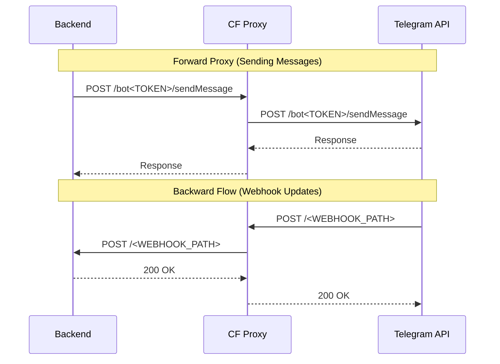

# cf-worker-telegram

A lightweight Cloudflare Worker that acts as a transparent proxy for the Telegram Bot API.  

Includes **bidirectional redirection**:
- **Forward**: Proxy API requests to Telegram (`api.telegram.org`)
- **Backward**: Forward Telegram webhook updates to your own backend server



## 🔧 Configuration

Update the constants at the top of the `index.js` file:

```javascript
const BACKEND_URL = "https://your-project-name.workers.dev"; // Your backend server
const WEBHOOK_PATH = "webhook/telegram-bot";                 // The path for receiving webhooks
```

## 🚀 Deployment

Deploy to Cloudflare Workers using [Wrangler](https://developers.cloudflare.com/workers/wrangler/):

```bash
npx wrangler deploy
```

## 📖 Usage

### Forward Proxy

In you codebase replace `api.telegram.org` with your Cloudflare Worker domain, e.g. `my-tg-proxy.workers.dev`.

### Webhook Setup

Set your webhook to use the proxy domain. Telegram will send updates to your worker, which will then forward them to `https://{BACKEND_URL}/{WEBHOOK_PATH}`.

```bash
curl -X POST "https://{YOUR_WORKER_URL}/bot{YOUR_BOT_TOKEN}/setWebhook" \
     -H "Content-Type: application/json" \
     -d '{"url": "https://{YOUR_WORKER_URL}/{WEBHOOK_PATH}"}'
```

### Downloading Files

```
https://{YOUR_WORKER_URL}/file/bot{YOUR_BOT_TOKEN}/{file_path}
```

### Health Check

Returns a 200 OK with `{"status":"ok"}`:
```
https://{YOUR_WORKER_URL}/health
```

## 🗺️ Roadmap & Upcoming Improvements

We're building this in the open! Here are the next steps we're planning to tackle:

- [ ] **Modernize the codebase**: Migrate to the latest Cloudflare Worker syntax.
- [ ] **Better Config Management**: Stop hardcoding values and switch to environment variables.
- [ ] **Local Dev Experience**: Make it easy to run and test the proxy on your machine.
- [ ] **One-Click Magic**: Add a "Deploy to Cloudflare" button for instant setup.
- [ ] **Auto-Deploy**: Set up a CI pipeline to handle deployments whenever we push to `main`.
- [ ] **Security Hardening**: Look into adding security headers for the backward flow to keep things extra safe.

